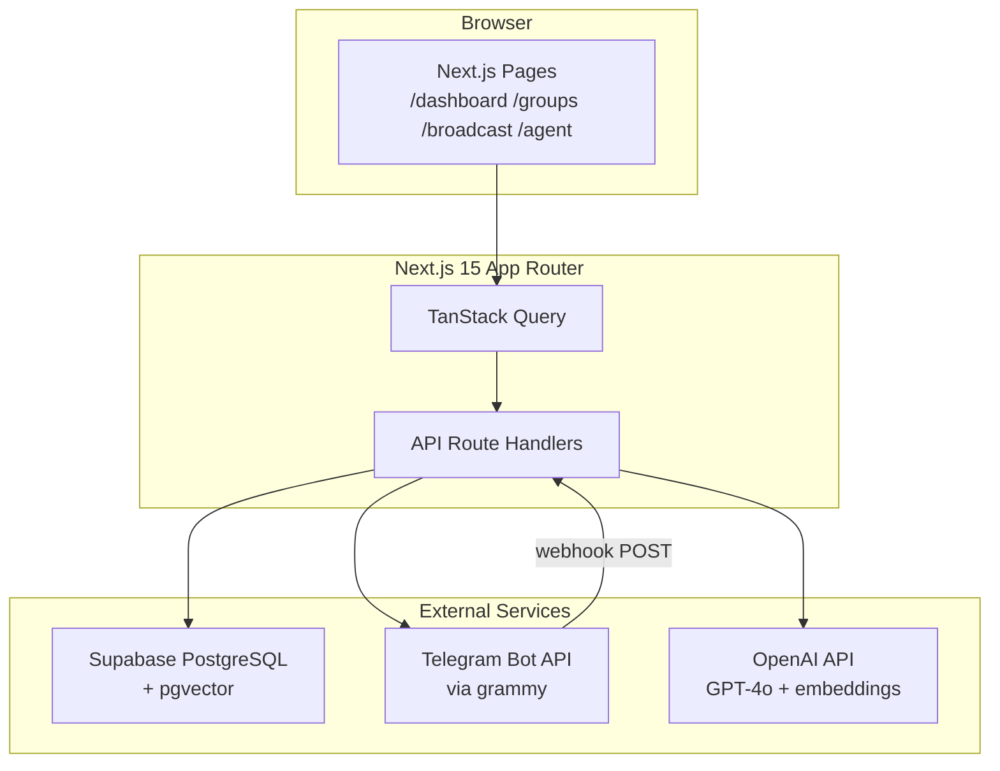
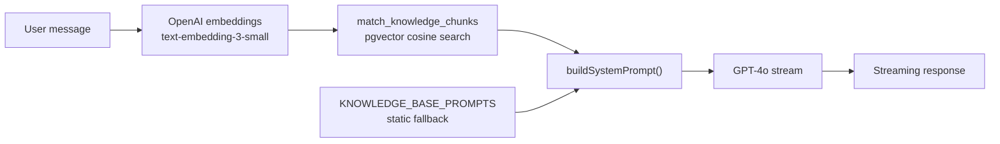
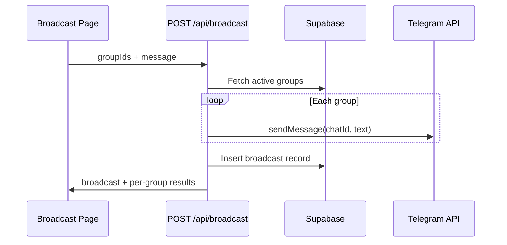
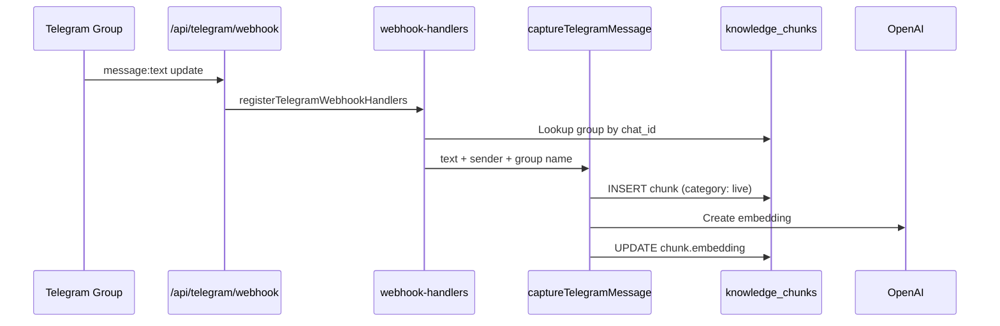

# Lubot

**Unified communication management for Telegram power users.**

Lubot is a hackathon-built web app that lets community managers connect Telegram groups, broadcast messages to multiple groups at once, and run an AI onboarding agent grounded on community knowledge — with optional pgvector RAG for semantic search.

---

## Table of Contents

1. [What is Lubot](#1-what-is-lubot)
2. [Architecture Overview](#2-architecture-overview)
3. [Tech Stack](#3-tech-stack)
4. [Prerequisites](#4-prerequisites)
5. [Getting Started](#5-getting-started)
6. [Environment Variables](#6-environment-variables)
7. [Database](#7-database)
8. [Telegram Bot Setup](#8-telegram-bot-setup)
9. [Pages & Routes](#9-pages--routes)
10. [API Routes](#10-api-routes)
11. [Feature Map — Real vs Mock](#11-feature-map--real-vs-mock)
12. [Agent & RAG Architecture](#12-agent--rag-architecture)
13. [Data Flow](#13-data-flow)
14. [Component Breakdown](#14-component-breakdown)
15. [Available Scripts](#15-available-scripts)
16. [Demo Script](#16-demo-script)
17. [Troubleshooting](#17-troubleshooting)
18. [Roadmap](#18-roadmap)
19. [Development Workflow](#19-development-workflow)

---

## 1. What is Lubot

Lubot has two core features:

### Feature 1 — Broadcast Dashboard

A dashboard where users connect Telegram groups and send private, selective messages to multiple groups at once — with scheduling support.

**Core value:** A community manager with 70 groups can select 25, write once, and send. Each group receives it as if it were sent directly to them only.

### Feature 2 — Onboarding Agent

An AI chat interface that answers questions about a community or company's history, culture, and workflows — sourced from a pre-loaded knowledge base and live Telegram message capture.

**Core value:** A new member or employee asks *"What are the rules here?"* and gets an accurate, grounded answer instantly — without blocking any human.

### Knowledge contexts

The agent supports four demo contexts, each backed by seed data in `knowledge_chunks`:

| Context | Description |
|---------|-------------|
| `demo` | Generic tech/entrepreneurship community in Baku |
| `accessbank` | AccessBank Azerbaijan internal onboarding |
| `amcham` | American Chamber of Commerce in Azerbaijan |
| `neurotime` | Neurotime AI company internal knowledge |

---

## 2. Architecture Overview



### Auth mode

`AUTH_ENABLED=false` by default — all routes are public, Supabase is accessed with the anon key, and no login is required. Set `AUTH_ENABLED=true` in `.env` to re-enable the full login wall (middleware redirects, `/auth/*` pages) when moving toward production. Auth pages are preserved under `src/app/auth/`.

---

## 3. Tech Stack

| Layer | Technology | Notes |
|-------|------------|-------|
| Framework | Next.js 15 (App Router) | React 18, TypeScript |
| UI | Shadcn/UI + Radix UI | Tailwind CSS styling |
| Database | Supabase (PostgreSQL) | Anon key access during hackathon |
| Vector Search | pgvector | `match_knowledge_chunks` RPC for RAG |
| Telegram | grammy | Bot instance in `src/lib/telegram.ts` |
| AI / LLM | OpenAI API | GPT-4o for chat, text-embedding-3-small for RAG |
| Data Fetching | TanStack Query | Hooks in `src/lib/api/queries.ts` |
| Charts | Recharts | Dashboard analytics |
| i18n | next-intl | English + French (boilerplate) |
| Icons | lucide-react | Sidebar and UI icons |
| Font | Plus Jakarta Sans | Via `next/font` in layout |

---

## 4. Prerequisites

- **Node.js 20+**
- **Supabase project** — remote (dashboard) or local via Docker (`npx supabase start`)
- **Telegram bot token** — create via [@BotFather](https://t.me/BotFather)
- **OpenAI API key** — for agent chat and embeddings
- **Public HTTPS URL** — required for Telegram webhooks (use [ngrok](https://ngrok.com) locally or deploy to Vercel)

---

## 5. Getting Started

### 1. Clone and install

```bash
git clone <repo-url> lubot
cd lubot
npm install
```

### 2. Configure environment

```bash
cp .env.example .env
```

Fill in all values — see [Environment Variables](#6-environment-variables).

### 3. Apply database migration

**Remote Supabase:** paste and run the migration in the SQL Editor, or:

```bash
npx supabase db push
```

**Local Supabase:**

```bash
npx supabase start
npx supabase db push --local
```

Migration file: [`supabase/migrations/20260523141400_lubot_initial_schema.sql`](supabase/migrations/20260523141400_lubot_initial_schema.sql)

Verify: 3 tables (`groups`, `broadcasts`, `knowledge_chunks`) and 22 rows in `knowledge_chunks`.

### 4. Regenerate TypeScript types

```bash
npm run gen:types          # local Docker
npm run gen:types:remote   # remote project (requires npx supabase login)
```

### 5. Set up Telegram bot

1. Create a bot via @BotFather → copy token into `.env` as `TELEGRAM_BOT_TOKEN`
2. Add the bot as **admin** (not just member) to each Telegram group you want to connect
3. Set `NEXT_PUBLIC_APP_URL` to your public HTTPS URL

### 6. Register webhook (one-shot)

With the dev server running and a public URL configured:

```bash
curl https://your-app-url/api/telegram/setup
```

Or visit `/api/telegram/setup` in the browser. This calls `bot.api.setWebhook()` pointing to `/api/telegram/webhook`.

### 7. Backfill embeddings (optional but recommended for RAG)

```bash
curl https://your-app-url/api/admin/backfill-embeddings
```

Populates OpenAI embeddings for all seed chunks that have `NULL` embedding.

### 8. Start development server

```bash
npm run dev
```

Visit `http://localhost:3000`.

---

## 6. Environment Variables

All env vars are centralised in [`src/lib/env.ts`](src/lib/env.ts). **Never read `process.env.*` directly** in app code except inside that file.

### `.env` reference

| Variable | Access | Description |
|----------|--------|-------------|
| `NEXT_PUBLIC_SUPABASE_URL` | `env().SUPABASE_URL` | Supabase project URL |
| `NEXT_PUBLIC_SUPABASE_PUBLISHABLE_KEY` | `env().SUPABASE_ANON_KEY` | Supabase anon/publishable key |
| `NEXT_PUBLIC_APP_URL` | `env().APP_URL` | Public app URL (webhook registration) |
| `AUTH_ENABLED` | `env().AUTH_ENABLED` | `"true"` or `"false"` — auth gate toggle |
| `SUPABASE_SERVICE_ROLE_KEY` | `serverEnv().SERVICE_ROLE_KEY` | Server-only Supabase key |
| `OPENAI_API_KEY` | `serverEnv().OPENAI_API_KEY` | OpenAI API key |
| `TELEGRAM_BOT_TOKEN` | `serverEnv().TELEGRAM_BOT_TOKEN` | BotFather token |

### Access patterns

```typescript
// Client-safe — use anywhere (components, hooks, middleware)
import { env } from '@/lib/env';
env().SUPABASE_URL
env().AUTH_ENABLED // "true" | "false"

// Server-only secrets — ONLY in server components, route handlers, middleware
import { serverEnv } from '@/lib/env';
serverEnv().OPENAI_API_KEY
serverEnv().TELEGRAM_BOT_TOKEN
```

Restart the dev server after changing `.env`.

---

## 7. Database

### Migration

[`supabase/migrations/20260523141400_lubot_initial_schema.sql`](supabase/migrations/20260523141400_lubot_initial_schema.sql)

Also documented in [`docs/raw/schema.md`](docs/raw/schema.md).

### Tables

#### `groups`

Stores connected Telegram (and future WhatsApp/Discord/Slack) groups.

| Column | Type | Notes |
|--------|------|-------|
| `id` | uuid | Primary key |
| `name` | text | Group display name |
| `platform` | text | `telegram` \| `whatsapp` \| `discord` \| `slack` |
| `telegram_chat_id` | text | Unique Telegram chat ID (negative for groups) |
| `member_count` | integer | From Telegram API |
| `is_active` | boolean | Whether the bot is still in the group |
| `connected_at` | timestamptz | When connected |
| `updated_at` | timestamptz | Last update |

#### `broadcasts`

Stores sent and scheduled broadcasts.

| Column | Type | Notes |
|--------|------|-------|
| `id` | uuid | Primary key |
| `message` | text | Message content (max 4096 chars) |
| `group_ids` | uuid[] | Target group IDs |
| `platform` | text | Default `telegram` |
| `status` | text | `sent` \| `scheduled` \| `failed` \| `partial` |
| `scheduled_at` | timestamptz | NULL if sent immediately |
| `sent_at` | timestamptz | When delivered or attempted |
| `recipient_count` | integer | Number of groups targeted |
| `created_at` | timestamptz | Record creation time |

#### `knowledge_chunks`

Pre-loaded and live-captured knowledge for the onboarding agent.

| Column | Type | Notes |
|--------|------|-------|
| `id` | uuid | Primary key |
| `content` | text | Text chunk |
| `source` | text | `demo` \| `accessbank` \| `amcham` \| `neurotime` |
| `category` | text | `rules` \| `workflows` \| `faq` \| `culture` \| `products` \| `live` |
| `metadata` | jsonb | Extra data (sender, chat ID, etc.) |
| `embedding` | vector(1536) | OpenAI text-embedding-3-small; NULL until backfilled |
| `created_at` | timestamptz | Record creation time |

### pgvector RAG function

```sql
match_knowledge_chunks(
  query_embedding vector(1536),
  match_threshold float default 0.78,
  match_count int default 10,
  filter_source text default null
)
```

Returns the most semantically similar chunks by cosine distance. Used by [`src/app/api/agent/chat/route.ts`](src/app/api/agent/chat/route.ts) with `match_threshold: 0.5` and `match_count: 5`.

### Seed data

22 knowledge chunks are pre-loaded across four sources (demo, accessbank, amcham, neurotime). Run the backfill endpoint to populate embeddings for RAG.

### Row Level Security

RLS is **disabled** for the hackathon. Tables grant full access to `anon` and `authenticated`. Enable RLS and add `auth.uid()` policies before production — see `.cursor/rules/create-rls-policies.mdc`.

---

## 8. Telegram Bot Setup

### Create the bot

1. Message [@BotFather](https://t.me/BotFather) on Telegram
2. Run `/newbot` and follow prompts
3. Copy the token into `.env` as `TELEGRAM_BOT_TOKEN`

### Add bot to groups

The bot must be an **admin** in each group — not just a member — to send broadcast messages.

### Get chat IDs

Group chat IDs are negative numbers. Supergroups typically start with `-100`. Use [@userinfobot](https://t.me/userinfobot) or forward a message to get the ID.

The app handles chat ID variants (`-100…` vs legacy `-…` form) via `chatIdLookupVariants()` in [`src/lib/telegram-message-capture.ts`](src/lib/telegram-message-capture.ts).

### Webhook registration

| Endpoint | Method | Purpose |
|----------|--------|---------|
| `/api/telegram/setup` | GET | One-shot: registers webhook URL with Telegram |
| `/api/telegram/status` | GET | Health check: webhook info, connected group count, capture rules |
| `/api/telegram/webhook` | POST | Receives Telegram updates (grammy webhook callback) |

`NEXT_PUBLIC_APP_URL` must be a publicly reachable **HTTPS** URL. For local dev, use ngrok:

```bash
ngrok http 3000
# Set NEXT_PUBLIC_APP_URL=https://xxxx.ngrok.io
npm run dev
curl https://xxxx.ngrok.io/api/telegram/setup
```

### Group Privacy Mode

In @BotFather: **Bot Settings → Group Privacy → Turn off**. Otherwise the bot only receives commands and @mentions, not normal group messages needed for live capture.

### Live message capture

When the webhook is active, non-command group messages (≥3 chars, from non-bots) in connected groups are:

1. Looked up in the `groups` table
2. Inserted into `knowledge_chunks` with `category: 'live'`
3. Embedded via OpenAI and stored for RAG

See [`src/lib/telegram-webhook-handlers.ts`](src/lib/telegram-webhook-handlers.ts) and [`src/lib/telegram-message-capture.ts`](src/lib/telegram-message-capture.ts).

---

## 9. Pages & Routes

| Path | Type | Status | Description |
|------|------|--------|-------------|
| `/` | Server | Live | Landing page (`LandingPage` component) |
| `/dashboard` | Client | Hybrid | Stats, charts, connected groups, recent broadcasts — live data merged with mock baseline |
| `/groups` | Client | Live | List, filter, and connect Telegram groups |
| `/broadcast` | Client | Live | Multi-group message composer with scheduling |
| `/agent` | Client | Live | AI chat with context selector and RAG |
| `/settings` | — | Pending | Sidebar link exists; page not built yet |
| `/auth/*` | Server | Preserved | Login/forgot-password — inactive when `AUTH_ENABLED=false` |

All app pages (except `/`) are wrapped in [`LubotShell`](src/components/layout/LubotShell.tsx) with the sidebar from [`app-sidebar.tsx`](src/components/app-sidebar.tsx).

---

## 10. API Routes

| Method | Path | Status | Description |
|--------|------|--------|-------------|
| GET | `/api/groups` | Live | List active groups from Supabase |
| POST | `/api/groups` | Live | Connect a group by chat ID — verifies bot admin via Telegram API |
| GET | `/api/groups/avatar?chatId=` | Live | Proxy Telegram group photo (never exposes bot token to client) |
| POST | `/api/broadcast` | Live | Send or schedule a broadcast to selected groups |
| GET | `/api/dashboard` | Hybrid | Aggregated stats, chart data, recent broadcasts — merged with mock baseline |
| POST | `/api/agent/chat` | Live | Streaming GPT-4o chat with pgvector RAG |
| GET | `/api/telegram/setup` | Live | Register webhook URL with Telegram |
| GET | `/api/telegram/status` | Live | Webhook health check and capture rules |
| POST | `/api/telegram/webhook` | Live | Telegram update handler (grammy) |
| GET | `/api/admin/backfill-embeddings` | Live | One-shot: embed all chunks with NULL embedding |

### Broadcast API

`POST /api/broadcast` body:

```json
{
  "groupIds": ["uuid-1", "uuid-2"],
  "message": "Hello everyone!",
  "scheduledAt": "2026-05-24T10:00:00.000Z"
}
```

- Immediate send: omit `scheduledAt` — messages are delivered via `sendTelegramMessage()` per group
- Scheduled: provide future ISO date — stored with `status: 'scheduled'`, no Telegram send yet
- Returns `{ broadcast, results }` where `results` contains per-group success/failure

### Agent chat API

`POST /api/agent/chat` body:

```json
{
  "messages": [{ "role": "user", "content": "What are the community rules?" }],
  "context": "demo",
  "groupId": "optional-uuid"
}
```

Returns a streaming `text/plain` response (GPT-4o token stream).

---

## 11. Feature Map — Real vs Mock

| Feature | Status | Notes |
|---------|--------|-------|
| Connect Telegram group | **Real** | POST `/api/groups` verifies via grammy |
| List connected groups | **Real** | From Supabase; demo groups shown if DB empty |
| Send broadcast | **Real** | Immediate delivery via Telegram Bot API |
| Schedule broadcast | **Real (DB)** | Stored as `scheduled`; cron/worker not implemented |
| Group avatars | **Real** | Proxied from Telegram via `/api/groups/avatar` |
| Agent chat | **Real** | GPT-4o streaming |
| pgvector RAG | **Real** | Embeddings + `match_knowledge_chunks`; static prompts as fallback |
| Live message capture | **Real** | Webhook → `knowledge_chunks` with embedding |
| Dashboard stats | **Hybrid** | Live counts merged with mock baseline (`merge-stats.ts`) |
| Dashboard charts | **Hybrid** | Real sent broadcasts + mock history fill |
| Broadcast engagement | **Mock** | Deterministic views/replies via `enrich-broadcast-engagement.ts` |
| Agent query count | **Mock** | Hardcoded in dashboard stats |
| WhatsApp / Discord / Slack | **Mock** | Provider filter UI only; no integration |
| Settings page | **Pending** | Sidebar link, no page |
| Authentication | **Disabled** | `AUTH_ENABLED=false`; pages preserved for production |

---

## 12. Agent & RAG Architecture



### Context selection

Group name inference maps connected groups to knowledge contexts via [`src/lib/agent-group-context.ts`](src/lib/agent-group-context.ts):

| Group name contains | Context |
|---------------------|---------|
| `accessbank` or `access bank` | `accessbank` |
| `amcham` or `chamber` | `amcham` |
| `neurotime` | `neurotime` |
| (default) | `demo` |
| All groups selected | `all` |

### Static knowledge base

[`src/lib/openai.ts`](src/lib/openai.ts) defines `KNOWLEDGE_BASE_PROMPTS` for each context — used as the base system prompt and as fallback when RAG returns no chunks.

### RAG retrieval

[`src/app/api/agent/chat/route.ts`](src/app/api/agent/chat/route.ts):

1. Embeds the latest user message
2. Calls `match_knowledge_chunks` with threshold `0.5`, count `5`, optional source filter
3. Injects retrieved passages into the system prompt
4. Streams GPT-4o response

If RAG fails or returns nothing, the static prompt alone is used (graceful degradation).

### Backfill embeddings

Seed chunks are inserted without embeddings. Call once:

```
GET /api/admin/backfill-embeddings
```

Safe to call multiple times — skips rows that already have embeddings.

---

## 13. Data Flow

### Broadcast send



### Live message capture → RAG



At query time, captured chunks are retrieved via pgvector similarity search in the agent chat route.

---

## 14. Component Breakdown

### Layout

| Component | Path | Purpose |
|-----------|------|---------|
| `LubotShell` | `src/components/layout/LubotShell.tsx` | Sidebar + main content wrapper |
| `AppSidebar` | `src/components/app-sidebar.tsx` | Navigation: Dashboard, Groups, Broadcast, Agent, Settings |

### Agent (`src/components/agent/`)

| Component | Purpose |
|-----------|---------|
| `ChatArea` | Full chat UI with streaming, group selector |
| `ChatInput` | Textarea, Enter to send |
| `ChatMessage` | User/assistant bubbles + typing indicator |
| `CompactInsightsBar` | Context-specific insights and suggested questions |
| `GroupChatSelect` | Pick a group or "All" for context |
| `AgentSurfaceCard` | Card wrapper for agent surface |

### Broadcast (`src/components/broadcast/`)

| Component | Purpose |
|-----------|---------|
| `BroadcastComposer` | Chat-style composer with `+` / `@` group picker |
| `BroadcastConfirm` | Confirmation dialog before send |
| `RecipientChips` | Selected group chips |
| `GroupMentionMenu` | @-mention style group selector |
| `AttachmentChips` | Mock image/voice attachment UI |
| `SuggestedGroupChips` | Quick group suggestions |

### Dashboard (`src/components/dashboard/`)

| Component | Purpose |
|-----------|---------|
| `StatCard` | Single stat with live/mock hint |
| `ConnectedGroups` | Avatar stack of connected groups |
| `DashboardCharts` | Recharts area + bar charts |
| `RecentBroadcasts` | Broadcast history with engagement metrics |
| `DashboardSkeleton` | Loading state |
| `EngagementBar` | Per-broadcast engagement visualization |
| `BroadcastGroupList` | Groups targeted by a broadcast |

### Groups (`src/components/groups/`)

| Component | Purpose |
|-----------|---------|
| `GroupsTable` | Filterable table of connected groups |
| `ConnectGroupDialog` | 3-step connect flow (instructions → chat ID → confirm) |
| `GroupAvatar` | Avatar with Telegram photo or initials fallback |
| `ProviderLogo` | Platform logo (Telegram, WhatsApp, etc.) |

### Shared

| Component | Purpose |
|-----------|---------|
| `ComingSoonBadge` | Overlay for mocked/upcoming features |

### Lib / API helpers (`src/lib/`)

| Module | Purpose |
|--------|---------|
| `api/groups.ts` | Group fetch + connect helpers |
| `api/broadcast.ts` | Broadcast send helper |
| `api/dashboard.ts` | Dashboard data fetch |
| `api/queries.ts` | TanStack Query hooks (`useGroups`, `useDashboard`, `useSendBroadcast`) |
| `dashboard/merge-stats.ts` | Merge live + mock dashboard data |
| `dashboard/enrich-broadcast-engagement.ts` | Mock engagement metrics |
| `mock-data.ts` | Demo groups, stats, chart baseline |
| `mock-insights.ts` | Context-specific insight cards |
| `suggested-questions.ts` | Agent suggested question chips |
| `opening-messages.ts` | Agent welcome messages per context |

---

## 15. Available Scripts

| Script | Command | Description |
|--------|---------|-------------|
| Dev server | `npm run dev` | Start Next.js on `localhost:3000` |
| Build | `npm run build` | Production build |
| Start | `npm run start` | Start production server |
| Typecheck | `npm run typecheck` | Run `tsc --noEmit` |
| Lint | `npm run lint` | ESLint (currently disabled) |
| Format | `npm run format` | Prettier format `src/` |
| Gen types (local) | `npm run gen:types` | Generate Supabase types from local Docker |
| Gen types (remote) | `npm run gen:types:remote` | Generate types from remote project |
| Unit tests | `npm run test` | Vitest |
| Cypress (open) | `npm run cypress:open` | E2E test runner UI |
| Cypress (run) | `npm run cypress:run` | Headless E2E tests |
| Storybook | `npm run storybook` | Component dev on `:6006` |
| Build Storybook | `npm run build-storybook` | Static Storybook build |

---

## 16. Demo Script

Practice this 3–4 minute flow:

1. **Open `/dashboard`** — *"Here's the Lubot overview."* Point out stat cards (~47+ groups, ~312+ broadcasts — mock baseline plus live data), the three connected groups, 30-day charts, and broadcast history with views, replies, engagement, and who replied.

2. **Go to `/groups`** — *"All connected Telegram groups in one place. Let me connect a new one."* → run connect flow live.

3. **Go to `/broadcast`** — *"Now I'll select 3 groups, write a message, and send."* → send live → show it arriving in Telegram → return to dashboard to show updated stats/history.

4. **Go to `/agent`** → select "AccessBank" → ask *"What is the process for onboarding a new branch employee?"* → show grounded answer.

5. **Mention:** *"WhatsApp and Discord are coming next. Settings page is on the roadmap."*

---

## 17. Troubleshooting

| Problem | Fix |
|---------|-----|
| Bot can't send to group | Make sure bot is **admin** in the group, not just a member |
| Chat ID not working | Group IDs are negative numbers. Supergroups start with `-100`. Use `@userinfobot` |
| OpenAI streaming not working | Return `new Response(readable)` not `NextResponse.json()` |
| Supabase RLS blocking reads | RLS is disabled in migration. If re-enabled, disable again or add policies |
| grammy Bot initialization fails | Check `TELEGRAM_BOT_TOKEN` is set. Bot initializes at import time in `telegram.ts` |
| pgvector extension missing | Run `create extension if not exists vector;` in Supabase SQL editor |
| Webhook not receiving messages | Verify HTTPS URL, call `/api/telegram/setup`, check `/api/telegram/status` |
| Bot not capturing group messages | Turn off Group Privacy in @BotFather; bot must be in a connected group |
| RAG returns no results | Run `/api/admin/backfill-embeddings` to populate seed chunk embeddings |
| Dashboard shows demo data only | Connect real groups and send broadcasts — live rows merge with mock baseline |

---

## 18. Roadmap

| Item | Status |
|------|--------|
| `/settings` page | Pending — sidebar link exists |
| Mobile sidebar (sheet/drawer) | Pending — offcanvas sidebar partially implemented |
| WhatsApp / Discord / Slack integration | Mock UI only |
| App-wide `ComingSoonBadge` sweep | Pending |
| Scheduled broadcast cron/worker | DB storage only; no delivery worker |
| Error states on all pages | Partial — groups page has error state |
| Full E2E test coverage | Pending |
| RLS + auth for production | Pending — enable `AUTH_ENABLED=true` |
| Design tokens / brand fonts | Pending |

For detailed build order and phase checklist, see [`docs/raw/execution-order.md`](docs/raw/execution-order.md).

---

## 19. Development Workflow

### Adding a new feature

1. Write a SQL migration in `supabase/migrations/` — follow `.cursor/rules/create-migration.mdc`
2. Apply it: `npx supabase db push` (local) or via Supabase dashboard
3. Regenerate types: `npm run gen:types` or `npm run gen:types:remote` — **never hand-edit** `src/types/database.ts`
4. Add an API helper in `src/lib/api/<feature>.ts` and React Query hooks in `src/lib/api/queries.ts`
5. Build the page/component that consumes the hooks

### Supabase access for the demo

New tables should grant full access to `anon` and `authenticated` with no RLS while `AUTH_ENABLED=false`. Before production, add RLS and `auth.uid()` policies.

### Environment variables

Add new vars to `.env` and `.env.example`, then wire through [`src/lib/env.ts`](src/lib/env.ts`:
- Public → add to `envRef` in `env()`
- Secret → add only to `serverEnv()`

### Project documentation

| Doc | Purpose |
|-----|---------|
| [`docs/AGENTS.md`](docs/AGENTS.md) | Agent read order, wiki access rules, self-update checklist |
| [`docs/raw/master.md`](docs/raw/master.md) | Full hackathon wiki (927 lines) |
| [`docs/raw/execution-order.md`](docs/raw/execution-order.md) | Phase checklist and demo script |
| [`docs/raw/schema.md`](docs/raw/schema.md) | Database schema reference |
| [`docs/raw/agent-page-knowledge-base.md`](docs/raw/agent-page-knowledge-base.md) | Agent page spec |
| [`AGENTS.md`](AGENTS.md) | Root agent brief |

### Auth toggle for production

Set `AUTH_ENABLED=true` in `.env` to re-enable middleware auth redirects and the `/auth/login` flow. Do not delete auth pages under `src/app/auth/`.

---

## License

MIT — see [LICENSE](LICENSE) for details.
